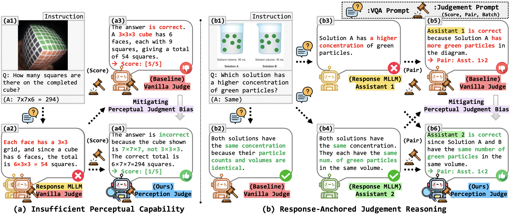

<h1 align="center">Mitigating Perceptual Judgment Bias in Multimodal LLM-as-a-Judge <br> via Perceptual Perturbation and Reward Modeling</h1>

<p align="center">
  <a href="https://arxiv.org/abs/2606.02578"></a>
  
  
</p>

<p align="center">
  <a href="https://perception-judge.github.io/"></a>
  <a href='https://huggingface.co/collections/sjpark5800/perception-judge'></a>
</p>

<p align="center">
  <a href="https://sjpark5800.github.io/">Seojeong Park</a><sup>1 *</sup>,&nbsp;
  <a href="https://jihochoi.github.io/">Jiho Choi</a><sup>1 *</sup>,&nbsp;
  <a href="https://scholar.google.com/citations?user=HjGzyO4AAAAJ&hl=ko">Junyong Kang</a><sup>1</sup>,&nbsp;
  <a href="https://glanceyes.github.io/">Seonho Lee</a><sup>2</sup>,&nbsp;
  <a href="https://scholar.google.com/citations?user=UbZM7nQAAAAJ&hl=ko">Jaeyo Shin</a><sup>1</sup>,&nbsp;
  <a href="https://kaist-cvml.github.io/index.html">Hyunjung Shim</a><sup>1 &dagger;</sup>
</p>

<p align="center">
  <sup>1</sup> KAIST AI &nbsp;
  <sup>2</sup> KRAFTON<br>
  <sup>*</sup> Equal contribution &nbsp; <sup>&dagger;</sup> Corresponding author
</p>

<div align="center">
    
</div>

<br>

This repository contains the official training, data preparation, and evaluation code for **Perception-Judge**, a multimodal LLM-as-a-judge trained to reduce perceptual judgment bias. The code release includes:

- GRPO training scripts built on top of [verl](https://github.com/verl-project/verl).
- The batch ranking reward used for PPJD training.
- Scripts for constructing PPJD from MMPR annotations.
- Evaluation scripts for MLLM-Judge.


## Resources

- Paper: [arXiv:2606.02578](https://arxiv.org/abs/2606.02578)
- Project page: <https://perception-judge.github.io/>
- Models and dataset: [Hugging Face collection](https://huggingface.co/collections/sjpark5800/perception-judge)

## Repository Structure

```text
.
+-- README.md
+-- prepare-datasets/          # PPJD construction pipeline
+-- eval/                      # MLLM-Judge generation/evaluation scripts
+-- verl/
    +-- perception_judge/      # Perception-Judge training scripts and reward function
    +-- ...                    # Upstream verl code
```

## Environment

We recommend Python 3.10 and CUDA-enabled GPUs. The training scripts in this release are configured for 8 GPUs by default.

```bash
conda create -n perception-judge python=3.10
conda activate perception-judge

pip install vllm==0.11.0
pip install flash_attn==2.8.2 --no-build-isolation
pip install transformers==4.57.3 datasets
pip install qwen_vl_utils flashinfer-python levenshtein

cd verl
pip install -r requirements.txt
cd ..
```

If you encounter dependency or CUDA issues when training with verl, we recommend using the official verl Docker image:

```bash
docker pull verlai/verl:base-verl0.6-cu128-cudnn9.8-torch2.8.0-fa2.7.4
```

Inside the container:

```bash
pip config unset global.extra-index-url
pip config unset global.index-url
pip install vllm==0.11.0
pip install "numpy<2"
```

## Data

### Download PPJD dataset

We recommend using the released PPJD dataset for reproducing the training setup.

```bash
cd verl
hf download sjpark5800/PPJD_3k \
  --repo-type dataset \
  --local-dir ./ppjd_3k
cd ..
```

The training scripts expect:

```text
verl/ppjd_3k/train.parquet
verl/ppjd_3k/validation.parquet
```

### Build PPJD dataset from MMPR

To regenerate PPJD, use the scripts under `prepare-datasets/`. The pipeline starts from MMPR v1.2 annotations and constructs perceptually perturbed rejected responses. See [prepare-datasets/README.md](prepare-datasets/README.md) for the complete workflow.

## Training

All training commands should be run from the `verl/` directory.

### Full Fine-Tuning

```bash
cd verl

bash perception_judge/run_perception_judge_qwen3_4b.sh
bash perception_judge/run_perception_judge_qwen3_8b.sh
bash perception_judge/run_perception_judge_flex_7b.sh
```

The scripts use:

- `ppjd_3k/train.parquet` and `ppjd_3k/validation.parquet`
- `perception_judge/reward_function.py`
- GRPO with the custom `batch_reward_function`


### LoRA Training for Flex-VL-32B

The Flex-VL-32B script expects locally merged base weights at `verl/Flex-VL-32B-Instruct`. Generate them first:

```bash
cd verl
python perception_judge/lora_weight_merge.py
bash perception_judge/run_perception_judge_flex_32b.sh
```

## Evaluation

The evaluation scripts use [MLLM-Judge](https://github.com/Dongping-Chen/MLLM-Judge). Clone it inside the `eval/` directory before running evaluation.

```bash
cd eval
git clone https://github.com/Dongping-Chen/MLLM-Judge.git
```

Run evaluation for released full-model checkpoints:

```bash
bash eval.sh
```

Run evaluation for the Flex-VL-32B LoRA checkpoint:

```bash
bash eval_lora.sh
```


## Released Checkpoints

The evaluation scripts currently reference the following released checkpoints:

- [`sjpark5800/Perception-Judge-Qwen3-4B`](https://huggingface.co/sjpark5800/Perception-Judge-Qwen3-4B)
- [`sjpark5800/Perception-Judge-Qwen3-8B`](https://huggingface.co/sjpark5800/Perception-Judge-Qwen3-8B)
- [`sjpark5800/Perception-Judge-Flex-7B`](https://huggingface.co/sjpark5800/Perception-Judge-Flex-7B)
- [`sjpark5800/Perception-Judge-Flex-32B-LoRA`](https://huggingface.co/sjpark5800/Perception-Judge-Flex-32B-LoRA)


## Citation

If you find this repository useful, please cite our paper:

```bibtex
@inproceedings{perceptionjudge2026,
  title={Mitigating Perceptual Judgment Bias in Multimodal LLM-as-a-Judge via Perceptual Perturbation and Reward Modeling},
  author={Park, Seojeong and Choi, Jiho and Kang, Junyong and Lee, Seonho and Shin, Jaeyo and Shim, Hyunjung},
  booktitle={Proceedings of the 43rd International Conference on Machine Learning (ICML)},
  year={2026}
}
```

## Acknowledgements
This repository builds on [verl](https://github.com/verl-project/verl) and [Flex-Judge](https://github.com/jongwooko/flex-judge). The evaluation protocol uses [MLLM-Judge](https://github.com/Dongping-Chen/MLLM-Judge), and PPJD construction builds on [MMPR v1.2](https://huggingface.co/datasets/OpenGVLab/MMPR-v1.2). We thank the authors and maintainers of these projects.

## License

This codebase follows the Apache-2.0 license distributed with the included verl code. See [verl/LICENSE](verl/LICENSE) and [verl/Notice.txt](verl/Notice.txt).
